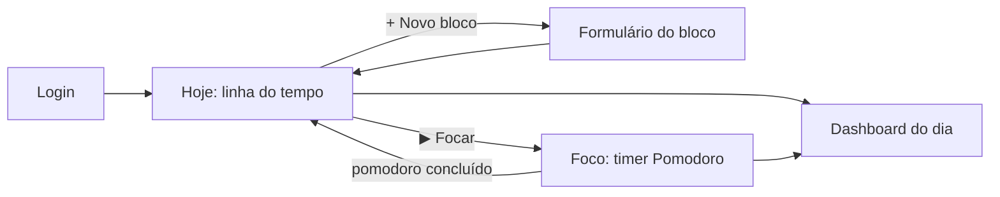

# 01 — Produto

O enunciado pede um app para **resolver o problema de gestão de horários de um usuário**,
usando os conceitos de *design thinking* e *design sprint* vistos na disciplina.
Este documento registra esse raciocínio de forma enxuta.

## 1. Entender (Empatizar + Definir)

### O problema

Listas de tarefas comuns respondem **"o que fazer"**, mas não respondem:

- **"Quando vou fazer isso?"** As tarefas ficam soltas, sem lugar na agenda, e acabam empurradas para depois.
- **"Quanto tempo isso realmente levou?"** Sem esse dado, a pessoa erra o planejamento sempre do mesmo jeito.
- **"Como foi meu dia?"** Sem um fechamento, não dá para perceber o progresso.

### Persona

> **Ana, 27 anos, desenvolvedora e estudante de pós.**
> Trabalha em home office, estuda à noite e tenta manter a academia.
> Usa o celular para tudo e já tentou vários apps de tarefas, mas abandona porque
> "a lista só cresce" e ela "nunca sabe se o dia rendeu".
> Quer algo **simples**, que abra rápido e funcione até sem internet.

### Declaração do problema

> Pessoas com rotina dividida entre trabalho, estudo e vida pessoal **precisam encaixar suas tarefas
> em horários concretos e acompanhar o tempo realmente dedicado**, porque listas soltas
> não ajudam a planejar o dia nem a avaliar se ele foi produtivo.

### "Como poderíamos…?"

- …transformar uma tarefa em um **compromisso com horário**?
- …ajudar a pessoa a **manter o foco** durante esse horário?
- …mostrar, em poucos segundos, **o que foi feito hoje**?

## 2. Idear

Técnicas que já são conhecidas e combinam com o problema:

| Ideia | Origem | Por que entra |
|---|---|---|
| **Time-blocking** | Agenda em blocos (método de Cal Newport e outros) | Cada tarefa ganha um horário e uma duração |
| **Pomodoro** | Francesco Cirillo, anos 1980: 25 min de foco + 5 min de pausa | Ajuda a manter o foco e gera um **dado real** de tempo focado |
| **Revisão diária** | Hábito comum em métodos de produtividade | O Dashboard fecha o dia |

## 3. Decidir (escopo do MVP)

**Obrigatório pelo enunciado**

- [ ] Tela de **Login**
- [ ] Tela **Home**: cadastrar tarefas do dia com **título**, **horário** e **status** (concluída ou não)
- [ ] Tela **Dashboard**: levantamento das tarefas **feitas no dia**

**Acréscimos do Ritmo**

- [ ] Duração e categoria em cada bloco; visualização em **linha do tempo**
- [ ] Navegar entre dias (planejar amanhã, rever ontem)
- [ ] **Timer Pomodoro** ligado a uma tarefa, que registra o tempo focado
- [ ] Dashboard com **planejado vs. focado**, % de conclusão e divisão por categoria
- [ ] Notificação quando o pomodoro termina
- [ ] Tela **Sobre / Relatório** com as 8 respostas teóricas do trabalho
- [ ] PWA instalável e funcionando offline

**Fora do escopo (de propósito)**

- Compartilhar tarefas entre usuários, integração com Google Agenda, push remoto (FCM).
  Isso aumentaria a complexidade sem acrescentar muito ao aprendizado da disciplina.

## 4. Prototipar

Fluxo principal (*user flow*):



Navegação principal (barra inferior, padrão de app mobile):

```text
┌───────────────────────────────┐
│  Ritmo            seg, 05 out │
│  ◀  Hoje  ▶                   │
│                               │
│ 08:00 ▌Estudar React   50min  │
│ 09:00 ▌Reunião daily   15min  │
│ 10:00 ▌Academia        60min  │
│                        [ + ]  │
├───────────────────────────────┤
│  Hoje   Foco   Dashboard Sobre│
└───────────────────────────────┘
```

## 5. Testar

Plano de validação (feito ao final das fases 4 e 5):

1. Pedir a 2 ou 3 pessoas que **planejem a manhã** e **façam um pomodoro**, sem explicar nada antes.
2. Observar onde travam (teste de usabilidade com a técnica de "pensar em voz alta").
3. Registrar os ajustes feitos neste documento.

| Observação | Ajuste |
|---|---|
| _a preencher_ | _a preencher_ |
