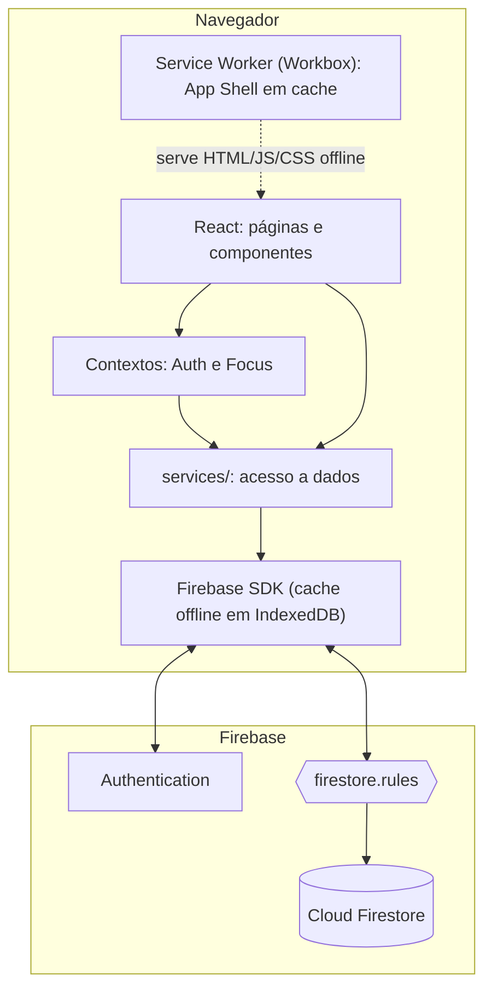

# 02 — Arquitetura

> Documento vivo: é atualizado a cada fase. Partes marcadas com ⏳ ainda não foram implementadas.

## Visão geral

O Ritmo é uma **SPA** (Single Page Application) em React servida como **PWA**.
Não existe servidor próprio: o navegador fala **direto** com o Firebase.

## Camadas (de cima para baixo)

| Camada | Pasta | Responsabilidade | Pode importar de |
|---|---|---|---|
| **Páginas** | `src/pages/` | Uma tela por rota; junta componentes e hooks | components, hooks, contexts |
| **Componentes** | `src/components/` | Partes visuais reutilizáveis | hooks, utils |
| **Hooks** | `src/hooks/` ⏳ | Lógica com estado reutilizável (`useTasks`, `usePomodoro`) | services, utils |
| **Contextos** | `src/contexts/` ⏳ | Estado global (usuário logado, timer ativo) | services, firebase |
| **Serviços** | `src/services/` ⏳ | **Único lugar que fala com o Firestore** | firebase, utils |
| **Utils** | `src/utils/` ⏳ | Funções puras (datas, estatísticas); fáceis de testar | nada |
| **Infra** | `src/firebase.js` ⏳ | Inicializa o SDK e conecta aos emuladores | — |

A regra principal: **componentes não importam `firebase/firestore`**. Eles chamam os serviços.
Esse é o mesmo princípio do `taskServiceProvider.js` do professor. Com isso, dá para trocar
Firestore por um dublê em memória (`VITE_DATA_BACKEND=mock`) sem mexer em nenhuma tela.

## Gerenciamento de estado

Seguindo o guia [Managing State](https://react.dev/learn/managing-state) do React,
indicado pelo professor:

| Tipo de estado | Onde fica | Exemplo |
|---|---|---|
| Local de um componente | `useState` | campos de um formulário |
| Compartilhado entre telas | **Context** | usuário logado (`AuthContext`), timer rodando (`FocusContext`) |
| Dados do servidor | **assinatura em tempo real** (`onSnapshot`) dentro de um hook | lista de blocos do dia |
| Precisa sobreviver a um reload | `localStorage` | estado do timer Pomodoro |
| Derivado | calculado no render (sem `useState`) | "feitas hoje", % de conclusão |

> **Estado derivado não vai para `useState`.** Se dá para calcular a partir de outro estado
> (por exemplo, `tasks.filter(t => t.completed)`), calcula-se no render. Guardar uma cópia
> cria duas fontes da verdade, que podem divergir.

## Rotas ⏳

| Rota | Tela | Protegida |
|---|---|---|
| `/login` | Login / Criar conta | não |
| `/hoje` | Linha do tempo do dia (Home do enunciado) | sim |
| `/foco` | Timer Pomodoro | sim |
| `/dashboard` | Resumo do dia | sim |
| `/sobre` | Sobre / Relatório | sim |
| `*` | redireciona para `/hoje` | — |

## Modelo de dados

Detalhado em [04-firebase.md](04-firebase.md#modelo-de-dados).
