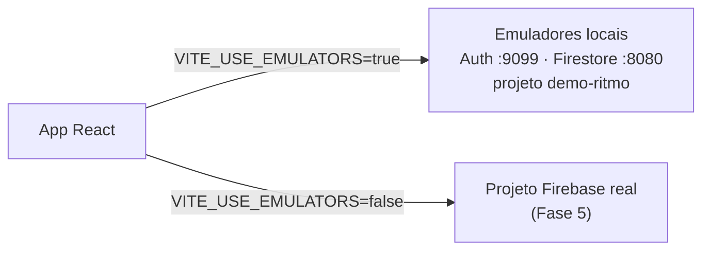

# 04 — Firebase

## O que usamos e por quê

| Serviço | Para quê | Substitui (projeto vanilla das aulas) |
|---|---|---|
| **Authentication** (e-mail/senha) | Login real, com a sessão guardada pelo SDK | Login fake no `localStorage` |
| **Cloud Firestore** | Banco NoSQL em tempo real, com cache offline | IndexedDB (Dexie) + fila "outbox" + Background Sync |

O Firestore grava **primeiro no cache local** e sincroniza quando a rede volta.
É o mesmo padrão *outbox* que fizemos à mão no `sw.js`, só que já embutido no SDK.

## Ambientes



### Emuladores (desenvolvimento)

```bash
npm run emulators
# = firebase emulators:start --only auth,firestore --import=./.emulator-data --export-on-exit
```

- **Painel**: <http://localhost:4000>. Dá para ver usuários, documentos e o log de **cada requisição
  com a regra que permitiu ou negou**. Ajuda muito a entender as regras.
- `--import` / `--export-on-exit`: os dados sobrevivem entre execuções (ficam em `.emulator-data/`).
- **Projeto `demo-ritmo`**: IDs começando com `demo-` são tratados pelo Firebase como projetos
  fictícios. O SDK e o CLI **nunca** acessam a nuvem com eles, então não há risco de mexer em dados reais
  e nem é preciso estar logado.
- O emulador do Firestore é um programa Java. Por isso é preciso ter o Java instalado. O README do
  professor menciona exatamente isso: no ambiente dele o download do `.jar` foi bloqueado, e por esse
  motivo ele criou o dublê em memória.

### Projeto real (Fase 5) ⏳

Será criado no Console/CLI, com Auth por e-mail/senha ativado. Regras e índices serão publicados com
`firebase deploy --only firestore`.

## Modelo de dados

Coleções na **raiz**, cada documento com o campo `uid` do dono (mesmo modelo do professor).

```text
tasks/{taskId}                     ← um bloco de tempo na agenda
  uid              string          dono (auth.uid)
  title            string          1–120 caracteres
  category         string          "trabalho" | "estudo" | "saude" | "pessoal"
  date             string          "YYYY-MM-DD"  dia do bloco (data local)
  startTime        string          "HH:MM"       horário de execução
  durationMinutes  int             5–720         tamanho planejado
  completed        bool
  completedAt      timestamp|null
  focusSeconds     int             tempo focado (somado pelo timer)
  pomodoros        int             pomodoros concluídos neste bloco
  createdAt        timestamp       serverTimestamp()

focusSessions/{sessionId}          ← um pomodoro concluído (histórico)
  uid, taskId|null, taskTitle|null, category|null,
  date "YYYY-MM-DD", startedAt, endedAt, durationSeconds (1 s a 4 h)
```

**Por que `date` e `startTime` são strings, e não `Timestamp`?**
Um bloco "às 08:00 do dia 05/10" é um conceito **local**: não deve mudar se o fuso horário mudar.
Strings `YYYY-MM-DD` e `HH:MM` também **ordenam corretamente em ordem alfabética**, então
`orderBy("startTime")` funciona sem conversões. Já `completedAt` e `createdAt` são instantes reais,
por isso usam `Timestamp`.

**Por que copiar `taskTitle` e `category` para `focusSessions`?**
É **desnormalização**, um padrão comum em NoSQL: o Firestore não tem *JOIN*. Sem a cópia, o Dashboard
teria que buscar a task de cada sessão. Além disso, o histórico continua legível mesmo se a task for
apagada.

## Regras de segurança

Arquivo: [`firestore.rules`](../firestore.rules).

No Firebase, **o cliente fala direto com o banco** e a configuração do app é pública. Então as regras são
o único "backend" que protege os dados. Elas fazem duas coisas:

1. **Autorização** (igual ao professor): só o dono (`resource.data.uid == request.auth.uid`) lê e altera.
2. **Validação** (acréscimo): `keys().hasOnly([...])` impede campos extras, e tipos, tamanhos e valores
   são verificados. Exemplos:
   - `createdAt == request.time` obriga o uso de `serverTimestamp()`;
   - na atualização, o `uid` não pode mudar ("doar" a task para outro usuário);
   - `focusSessions` não aceitam `update`: o histórico é imutável.

### Teste manual feito na Fase 0

Com os emuladores rodando, via REST:

| Cenário | Resultado esperado | Obtido |
|---|---|---|
| Ler `tasks/x` sem login | negado | HTTP 403 ✅ |
| Criar `focusSession` logado, com `uid` de outro usuário e sem os campos obrigatórios | negado | HTTP 403 ✅ |

## Índices

Arquivo: [`firestore.indexes.json`](../firestore.indexes.json).

O Firestore só executa consultas que tenham um índice correspondente. Índices de **um campo** são
automáticos. Consultas que combinam igualdade em um campo com ordenação em outro precisam de
**índice composto**:

```js
query(collection(db, "tasks"),
  where("uid", "==", uid),
  where("date", "==", "2026-10-05"),
  orderBy("startTime"))
// → índice (uid ↑, date ↑, startTime ↑)
```

O emulador não exige índices. Sem eles, porém, a consulta **falharia em produção** com um link
"crie este índice". Por isso os índices ficam versionados e são publicados junto com as regras.
